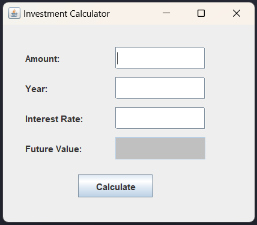

## Practical-12.1:

- Write a programme to implement an investement value calculator using the data inputed by user.
- TextFields to be included are amount, year, interest rate and future value.
- The field “future value” (shown in gray) must not be altered by user.

- <p align="center">
     
  </p>

---

### **Comon Methods:**

#### **setBounds():**

```java
component.setBounds(x, y, width, height);
```

---

#### **setEditable(boolean b):**

```java
textField.setEditable(false);  // User cannot type
textField.setEditable(true);   // User can type
```

---

#### **setBackground(Color c):**

```java
component.setBackground(Color.GRAY);
```

- We can use colors like `Color.RED`, `Color.BLUE`, `Color.GREEN`, `Color.LIGHT_GRAY`, or even create custom colors using:  

```java
new Color(255, 200, 100); // RGB color
```

---

#### **getText():**

- Used to get user input from a `JTextField`.
- Returns the text as a `String`.
  
```java
String input = textField.getText();
```

---

#### **setText(String s):**

- Used to set or display text in a `JTextField` or `JLabel`.

```java
textField.setText("Hello");
```

---

#### **Integer.parseInt(String s):**

- Converts a String to an `int`.
- Example: `"5"` → `5`

```java
int num = Integer.parseInt("10");
```

- If the string is not a valid number, it will throw an error.

---

#### **Double.parseDouble(String s):**
- Converts a String to a `double` (for decimal values).
- Example: `"3.14"` → `3.14`

```java
double rate = Double.parseDouble("3.5");
```

---

#### **Math.pow(base, exponent):**

- Returns base raised to the power of exponent.
- Example: `2^3 = 8`

```java
double result = Math.pow(2, 3);  // result = 8.0
```

---

#### **String.format():**

- `String.format()` is used to create formatted strings — like combining text with numbers in a neat way (with control over spacing, decimal places, etc).
- It's similar to `printf()` in C, but it returns a string instead of printing it directly.

```java
String formattedString = String.format("format_string", values...);
```

```java
int age = 20;
String msg = String.format("My age is %d years.", age);
System.out.println(msg);
```

- Format float/double with 2 decimal places:
```java
double price = 49.567;
String msg = String.format("Price: %.2f", price);
System.out.println(msg);  // Output: Price: 49.57
```

---

#### **JOptionPane:**

- `JOptionPane` is a part of Java Swing used to show dialog boxes like:
    - Alerts or Warnings
    - Asking questions (Yes/No/Cancel)
    - Input boxes
    - Custom messages

- It's a quick way to show a pop-up message to the user.
- You don't need to create a new window manually—Java handles it for you.

```java
JOptionPane.showMessageDialog(parentComponent, message);
```

- `parentComponent`: Usually the frame (or use `null` if no parent).
- `message`: What you want to show.

| Method Name               | Purpose                          |
|--------------------------|----------------------------------|
| `showMessageDialog()`    | Just shows a message             |
| `showConfirmDialog()`    | Shows Yes/No/Cancel options      |
| `showInputDialog()`      | Asks user for input (text)       |
| `showOptionDialog()`     | Lets you create custom buttons   |

---